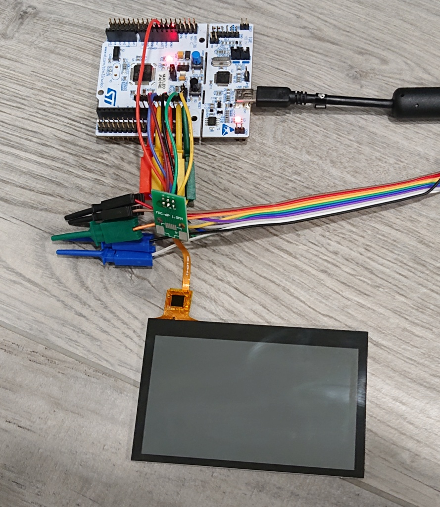
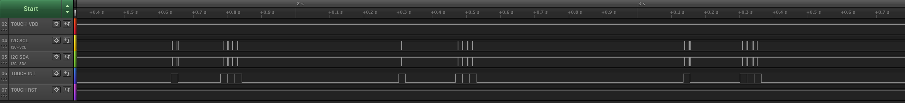
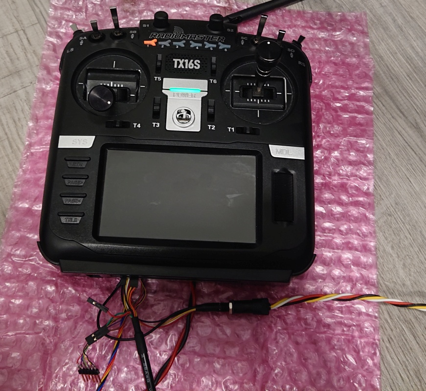

# Goodix GT911 test

Test software for the Goodix GT911 Touch Controller on RadioMaster TX16S

Based on code in EdgeTX https://github.com/EdgeTX/edgetx/blob/2.4/radio/src/targets/horus/tp_gt911.cpp

There are two [STM32CubeIDE](https://www.st.com/en/development-tools/stm32cubeide.html) projects available:
1. For Nucleo-F401RE development kit
2. For RadioMaster and Eachine TX16S

# 1. Usage with Nucleo-F401RE development kit

Hookup between RadioMaster TX16S 6-pin FFC touch controller cable to ST Nucleo-F401RE board:

* Pin 1 - GND - GND
* Pin 2 - I2C SCL - D15, PB8
* Pin 3 - I2C SDA - D14, PB9
* Pin 4 - INT - D12, PA6
* Pin 5 - !RST - D11, PA7
* Pin 6 - VDD - +3.3V



Via Nucleo Debug Virtual Serial Port (400000 baud 8N1) you get the same debug output as with EdgeTX when built with DEBUG=YES CMake option. Example (single finger tap):

```
+1598093ms:  touch state = 0x81
+1598094ms:  touch event = DOWN
+1598110ms:  touch state = 0x0
+1598110ms:  touch event = DOWN
+1598243ms:  touch state = 0x80
+1598244ms:  touch event = UP
+1598258ms:  touch state = 0x80
+1598259ms:  touch event = NONE
+1598275ms:  touch state = 0x0
+1598275ms:  touch event = NONE
+1598287ms:  touch state = 0x80
+1598288ms:  touch event = NONE
```

Under `/media` you can find an example I2C trace of 3 taps, created with [Saleae Logic v1.2.29](https://support.saleae.com/logic-software/legacy-software/older-software-releases)



# 2. Usage with RadioMaster and Eachine TX16S

This test software fully replaces the existing OpenTX or EdgeTX on your radio. You need to flash it back in DFU mode. SD card is not required for the test.
To flash the test software, you can use SWD-port, or you can grab a pre-built binary under `TX16S_I2C_GT911_Test/Release/` and flash it with [STM32CubeProgrammer](https://www.st.com/en/development-tools/stm32cubeprog.html).

Although I made great care to define all I/O pins correctly, no guarantee that it won't break your radio.

**Caution! This code does NO low battery checking, thus better run it solely on freshly charged battery for a limited time, or hook your radio to a power supply, e.g. via top USB-C port**

You will see green LED light in normal condition, if a touch hiccup is detected, the LED turns red. Via AUX1 you can get the same touch debug as with real EdgeTX/OpenTX when firmware is build with DEBUG=YES CMake option. 400000 baud 8N1. Here an example how it looks when the firmware is running on TX16S:



A brief press on the power button turns on the radio, a press longer than 1 second, turns the radio off again.
